<h1 align="left">Hey, I'm Gabriele 👋</h1>

  

  I prefer to be called <strong>Gabriele</strong>, but online I'm also known as <strong>ItsGabbooo</strong>.

  I'm a <strong>Minecraft plugin developer from Campania, Italy</strong>, passionate about game servers, performance, infrastructure and clean code.
  I mainly work with <strong>Java</strong> and <strong>Python</strong>, building custom Minecraft plugins, optimizing servers and managing VPS infrastructure.

  I'm currently attending an <strong>IT high school</strong>, and in my free time I work on my own plugins, Minecraft servers and programming projects.
  I also enjoy experimenting with new tools, frameworks, Linux environments and server infrastructure.

---

### 🧠 Tech & Tools

  

---

### 🚀 What I'm Working On

* 🌱 Improving my <strong>Java & Python</strong> skills
* ⚡ Building fast, clean and optimized <strong>Minecraft plugins</strong>
* 🖥️ Managing <strong>VPS & Linux servers</strong>
* 🧩 Developing my own <strong>Minecraft projects and tools</strong>
* 🚀 Working on <strong>???</strong>, my main Minecraft project
* 🔧 Experimenting with new technologies, frameworks and server setups

---

### 🎮 About Me

* 🧱 Minecraft plugin developer
* ☕ Java enthusiast
* 🐍 Python enjoyer
* 🐧 Linux & VPS enthusiast
* ⚙️ Interested in performance and optimization
* 🛠️ Always building something new
* 🇮🇹 Based in Campania, Italy

---

### 🌐 Social & Communities

* 💬 Discord: <strong>apprendimento</strong>
* 🕹️ Minecraft: <strong>???</strong>

---

### 📊 GitHub Stats

  
  

---

### 🚀 Featured Project

  <strong>ZestyNetwork</strong> 
  My main Minecraft project, focused on creating a unique, optimized and enjoyable server experience.

---

  <strong>💻 Code. Build. Optimize. Repeat.</strong>

  ⭐ Thanks for visiting my profile!

